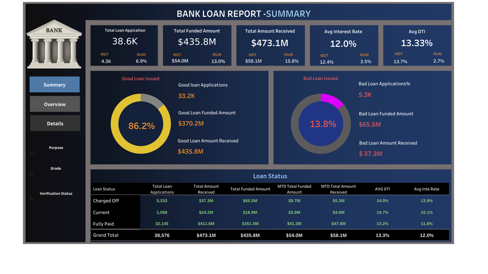
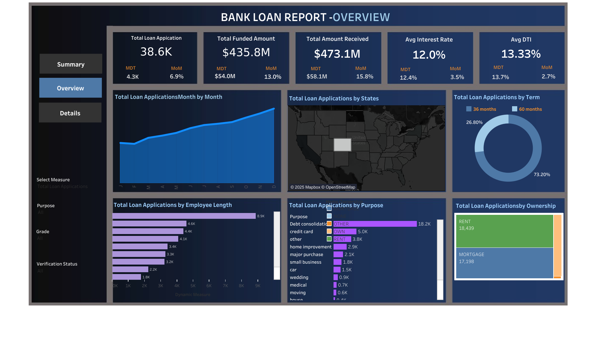
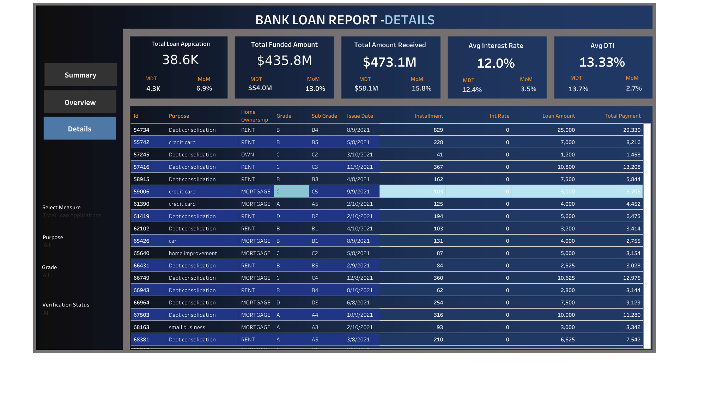

# Bank-Loan-Data-Analysis
"Data analysis and visualization of loan data using MS SQL and Tableau. The project features three dashboards: Summary (KPIs), Charts (loan trends, regional analysis, etc.), and Details (granular loan data). Provides actionable insights for decision-making, offering an in-depth view of loan metrics and borrower profiles."


# Bank Loan Data Analysis and Visualization

This project is a data analysis and visualization initiative focused on loan data, built using **MS SQL** for data processing and **Tableau** for creating interactive dashboards. The goal is to analyze key loan-related metrics and provide a holistic view of the loan portfolio, borrower profiles, and performance using various visualizations.

## Project Overview

The project consists of three key dashboards, each offering a different perspective on the loan data:

### 1. **Summary Dashboard**
The **Summary Dashboard** presents key performance indicators (KPIs) related to loan applications, funded amounts, repayments, average interest rates, and debt-to-income ratios. It provides a snapshot of the overall loan trends and helps assess the financial health of borrowers.

### 2. **Charts Dashboard**
The **Charts Dashboard** uses various types of visualizations, including line charts, bar charts, and treemaps, to analyze trends and patterns such as:
- Monthly loan application trends
- Regional disparities in loan activity
- Loan term distributions
- Employment length analysis
- Loan purposes and homeownership impact on loan applications

### 3. **Details Dashboard**
The **Details Dashboard** is a comprehensive view of granular loan data, offering a user-friendly interface to explore loan portfolios, borrower profiles, and performance metrics. This dashboard is designed for users who need detailed insights into the data.

## Project Dashboards

### Summary Dashboard


### Charts Dashboard


### Details Dashboard



## Project Structure Key Features

- **Loan Application Overview**: Get a comprehensive understanding of total loan applications, funded amounts, and repayments.
- **Visualized Trends**: Interactive visualizations of monthly loan trends, regional loan activities, and loan term distributions.
- **Detailed Insights**: Deep dive into loan portfolios, borrower demographics, and loan performance with filtering capabilities.

## Technologies Used

- **MS SQL**: Used for data extraction, processing, and analysis. The raw loan data was stored and queried in MS SQL.
- **Tableau**: Used for data visualization and creating interactive dashboards that provide meaningful insights from the data.

## How to Run This Project

### Prerequisites

1. **MS SQL**: Make sure you have access to the loan data in SQL format. You should have the MS SQL database installed and configured.
2. **Tableau**: Install Tableau Desktop for opening and interacting with the visualizations. You can download it from [Tableau Official Website](https://www.tableau.com/).

### Steps to Run

1. Clone this repository to your local machine:
   ```bash
  git clone https://github.com/MANAS2903/Bank-Loan-Data-Analysis.git
2 Open the MS SQL database and run any necessary queries to extract the data.

3 Open Tableau and import the workbook files located in the /Tableau-Workbooks folder.

4 Interact with the dashboards for visualizing the loan data and explore the various trends and metrics.

Future Improvements
Integration with real-time data sources to keep dashboards updated automatically.
Adding more advanced visualizations like heat maps, scatter plots, and predictive analytics.
Enhancing the SQL database with additional borrower data for deeper insights.

Acknowledgments
Thanks to the Tableau community for its vast array of resources and tutorials.
MS SQL documentation for providing essential guidance in data processing


